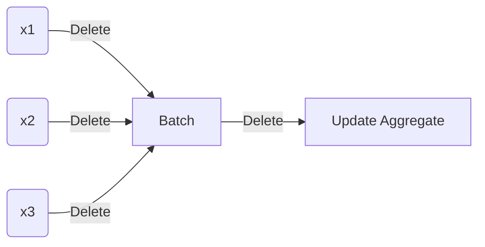

# Workflow for Developing Python Packages for Distribution

## Why package?

Python Packages allow us to take more full advantage of one of the great features of software: extensibility. It allows us to bundle up code that can be used again and again, often in novel extensions of the original use case. Creating packages also encourages us to write more robust and easy to understand code.  

## Before you Start

Your package is a piece of software that should enable your users to achieve some task. You should design it with the user's needs in mind. So, before you start, document these needs and design a package workflow that not only makes sense within the package, but also within the broader workflow that the user is likely using. 

> To design a useful package, have empathy for your users

Remember: you are writing code not so that it is easy for you to use and maintain, but so that it is easy for others to use and maintain.

In addition to a clear and meaningful workflow, a useful and robust package is (a) modular, (b) well documented, and (c) extensively and automatically tested. 

Strive for **modulatiry**. Writing functions that are small and specific--modular--enables easier testing, maintenence, and extensibility. The [unix philosophy](https://en.wikipedia.org/wiki/Unix_philosophy) can help guide our function design: 

> Make each [function] do one thing well.

The same rule holds for packages, make the package scope small and clearly defined.

Make your package **easily interoperable**. Expect it to accept standard inputs from other packages. Expect its outputs to become inputs to other programs. The simplest outputs are text strings. Self explainable pandas data frames or CSVs (just text strings) are likely good output choices for a Python package.  

Don't forget to **document** your package such that someone who was not involved in the package development (and yourself in the future) can fully understand it. This includes documenting:

- the purpose of the package
- the workflow of the package with examples
- each function's purpose, usage, and outputs with examples
- each function argument's description

It should be easy to write packge documentation. If your package is well defined in scope and the functions are focused, then the documentation should be easy to write. If you find yourself struggling to write complex documentation, this is a red flag that your functions/package are too complex.[^doc-red-flag]

 Don't forget to **test** your package.  [Test driven development](https://en.wikipedia.org/wiki/Test-driven_development)--where you write and automate the test for the correctness of your code before fully writing the code--enables you to create more robust code that is easier to maintain. It is more robust, because you have tests validating its correctness. It is more maintainable, because changes both to the package and its dependencies are automatically evaluated before deployment. Ideally your tests allow you to "fail fast" in that the tests fail close to the source of problem. This makes the debugging process faster. [pytest](https://docs.pytest.org/en/6.2.x/), as part of CI/CD pipeline allows you to automatically test your packages.

Take advantage of version control and CI/CD tools such as Git, GitHub, and GitHub actions. These tools allow you to develop new features while being confident that they only make it to the "release" version of the package once they have passed your tests.

## Example

### Workflow design

Before starting work on a package take some time to design the workflow a typical user might have with your package and their broader context (e.g. how the package might fit into to their existing workflow). This will help you (a) emphathise with the user, (b) define the modules (functions) of the package, and (c) already begin to document your package.

For example, imagine I want to create a Python package that finds the **batch** mean and variance for some vector of numbers. A key usecase would be to recursively update the mean and variance of an A/B test treatment group as it developed over time. This would allow us to reduce the amount of time that we need to keep or access personal level data. See [here](https://elegant-heyrovsky-54a43f.netlify.app/privacy-first-ds-mean-var.html) for details.

The purpose of the package is to *extend* the capabilities of a the standard `mean` and `var` (variance) functions from numpy. So, ideally, the bactch mean and variance from the package we are creating could fit into an existing workflow or something. What might this workflow be?

Imagine, that the user's goal is to run a t-test on an A/B test. Assume they have queried the entire data for some outcome KPI for both A and B treatment arms. The workflow might then look something like this:

```python
import numpy as np
import scipy as sp
from scipy import stats

# Generate two random samples from the standard normal distribution
sample_a = np.random.randn(1000)
sample_b = np.random.randn(1000)

# T-test of sample_a vs sample_b
t_stat, p_value = sp.stats.ttest_ind(sample_a, sample_b)
```

In the standard workflow, we simply take the full `numpy.ndarray`s that have the A/B test data and pass them to one scipy function `sp.stats.ttest`. 

To run a t-test on batch collected data, we need to extend this workflow. First, we need to collect the data recursively. Something like:



See [here](https://elegant-heyrovsky-54a43f.netlify.app/privacy-first-ds-mean-var.html) for details. The outcome of the batch updating process is summary statistics--mean, variance, sample size--not arrays. Scipy luckily has a function for running t-tests with only summary statistics: `sp.stats.ttest_ind_from_stats`. So we could create this workflow:

1. Batch update mean and variance to-date
2. Find t-test using `sp.stats.ttest_ind_from_stats`

In pseudocode this could look like:

```python
# Batch update 
```


There are two nice things about this workflow:

- It is extensible to the non-batch usecases. We just need some aggregation function at the "batch" step that finds the mean and variances.

- It is extensible to Bayesian analysis and updating. I aim to have more details later.

### File structure

Now that we have an initial package design in mind, let's create the basic file structure that you need for a Python package. 

First create a new directory for your package and commit it to some version control system such as GitHub. My initial file structure for the **stats_batch** package looks like this:

```shell
stats_batch
├── CHANGELOG
├── .github
│   └── workflow
├── LICENSE
├── stats_batch
│   ├── __init__.py
│   └── mean-var.py
├── README.md
└── setup.py
└── tests
```

The `__init__.py` file is empty. It denotes the directory as a Python package. Use the **setuptools** package to create the `setup.py` file. This file contains key metadata for your package. For example:

```python
from setuptools import setup

setup(
    name='stats_batch',
    version='0.0.9000',    
    description='Find statistics (e.g. mean and variance) using batch updating algorithms',
    url='https://github.com/christophergandrud/batch-stats',
    author='Christopher Gandrud',
    author_email='christopher.gandrud@gmail.com',
    license='MIT',
    packages=['stats_batch'],
    install_requires=['numpy',
                      'scipy'                   
                      ],

    classifiers=[
        'Development Status :: 1 - Planning',
        'Intended Audience :: Science/Research',
        'License :: OSI Approved :: MIT License',  
        'Programming Language :: Python :: 3.5',
    ],
)
```

See the [Python Packaging project](https://packaging.python.org/tutorials/packaging-projects/) for details.

In this example, the package functions will be in the `mean_var.py` file or module.  

#### Installing your package

Once you have these files in place, you can install your package. Go to the terminal. Make your package the working directory. Then use:

```bash
pip3 install .
```

### Documenting

#### README

The README file is the introduction to your package and package workflow. It should include the package's:

- purpose and context
- a minimal example of the package's workflow

#### Function documentation

Function documentation in Python is built from [docstrings](https://www.python.org/dev/peps/pep-0257/). For example:

```python
def add_two(x:int) -> int:
    """
    Add two to an integer
    
    Parameters
    ----------
   	x: int
   		An integer to add 2 to.
   	
   	Returns
   	-------
   	An integer that is x + 2.
   	
   	Examples
   	--------
   	>>> add_two(10)
    12
    """
    return x + 2
```

The function documentation is included in the function definition and denoted by three double quotes. The first line of the docstring describes the purpose of the function. Then we document the function's one argument `x`, describe what the function returns, and provide examples. Users can access this documentation by calling `help(add_two)`. 

There are multiple style guides for Python docstrings. One to recommend is the [numpy/scipy style guide](https://numpydoc.readthedocs.io/en/latest/format.html).

### Changelog

Each time you make a release of your package, you should document the changes in a CHANGELOG. 

### Coding 


#### Type checking

In docstring example above, we defined the functions arguments and what it returns:

```python
def add_two(x:int) -> int:
```

Notice that we defined the types of the arguments--`int`--and what the function returns. Each time a user runs the fuction, Python will check to ensure that the inputs and outputs are integers.[^types] Type checking is useful for:

- making how the function works in terms of inputs and outputs more obvious. This enables users to more easily extend the function to new use cases.
- catches problems sooner. A major source of user error is passing the data to a function that it does not know how to handle. Type checking helps catch this immediately.  

### Testing

 As you develop your package, build the suite of automated tests for it. To do this, create a directory called *tests*. In this directory, place Python files that begin with `test`. For example, here is `test_batch_mean.py`

```python
import stats_batch as sb
import numpy as np

# Test batch_mean returns the mean if prior_mean and prior_sample_size are missing
def test_batch_mean_missing_prior_mean_prior_sample_size():
    x = list(range(1, 100))
    assert sb.batch_mean(x) == np.mean(x) 
```

Then in the terminal, with the package as your working directory, use the **pytest** function to run all of the tests, e.g. in the command line:

```bash
pytest
```

Note: all of the test definitions need to begin with `test_`.

#### Code coverage


### CI/CD 

The public GitHub has a really good built in CI/CD platform called [GitHub Actions](https://github.com/features/actions). This will build your package and run all of the tests (if you set it up to) on multiple platforms. In your package, add the directory *.github/workflow*. Then place an Actions YAML file in this directory. [Here](https://github.com/christophergandrud/stats_batch/blob/main/.github/workflows/test-stats-batch.yaml) is an example to get started. Each time you push a commit, GitHub will run your tests. Click on the *Actions* tab on your repo's website to see the outcome of the tests. 

#### Branch control and releases

Your package should be in a version control system like GitHub. The *main* branch should be your "protected branch". Develop and test new code in other branches. Only merge code into the *main* branch after it has passed the automated tests and (if it is headed for production) review by a peer. On GitHub you can enforce this discipline with [branch control](https://docs.github.com/en/github/administering-a-repository/defining-the-mergeability-of-pull-requests/managing-a-branch-protection-rule).

Rules of thumb for this process include:

- Commit and merge often. Avoid trying to work on and then merge in very large changes. This is highly likely to create bugs that are hard to debugg.
- Changes should come with new tests. If it is a new feature, you need a test for the new feature. If it is a fix for a bug that was not caught in previous automated tests, add a new test to cover this bug.

### Distributing

Once you have your package built and tested, you can distribute it through the [PyPI](https://pypi.org/) package index. The [official tutorial](https://packaging.python.org/tutorials/packaging-projects/#generating-distribution-archives) has easy to follow instructions for how to do this. It is a good idea to try it out on the [test index](https://test.pypi.org/) first.

Assuming:

- your package pasts its tests

- you have a (test) PyPI account and API token

- have the **build** and **twine** packages installed,

  follow a workflow like this in your terminal:

```shell
# Build package
python3 -m build

# Upload built package to testpypi
python3 -m twine upload --repository testpypi dist/*

```

If successful, you should be given a URL for the packages directory.

[^doc-red-flag]: This is one of the red flags highlighted in Ousterhout's (2018) highly recommended "A Philosophy of Software Design".  ↩
[^types]: See [here](https://docs.python.org/3/library/stdtypes.html) for a full list of Python's built in types.

