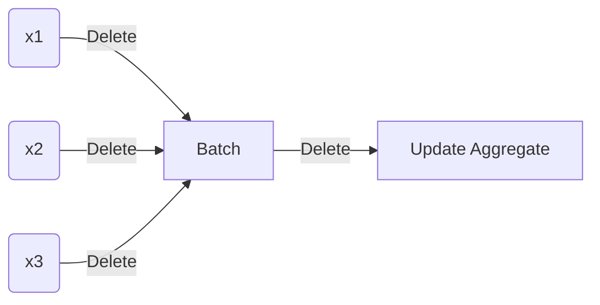

# Workflow for Python Package Development

## Why package?


## Before you Start

Your package is a piece of software that should enable your users to achieve some task. You should design it with the user's needs in mind. So, before you start, document these needs and design a package workflow that not only makes sense within the package, but also within the broader workflow that the user is likely using. 

> To design a useful package, have empathy for your users

Remember: you are writing code not so that it is easy for you to use and maintain, but so that it is easy for others to use and maintain.

In addition to a clear and meaningful workflow, a useful and robust package is (a) modular, (b) well documented, and (c) extensively and automatically tested. 

Strive for **modulatiry**. Writing functions that are small and specific--modular--enables easier testing, maintenence, and extensibility. The [unix philosophy](https://en.wikipedia.org/wiki/Unix_philosophy) can help guide our function design: 

> Make each [function] do one thing well.

The same rule holds for packages, make the package scope small and clearly defined.

Make your package **easily interoperable**. Expect it to accept standard inputs from other packages. Expect its outputs to become inputs to other programs. The simplest outputs are text strings. Self explainable pandas data frames or CSVs (just text strings) are likely good output choices for a Python package.  

Don't forget to **document** your package such that someone who was not involved in the package development (and yourself in the future) can fully understand it. This includes documenting:

- the purpose of the package
- the workflow of the package with examples
- each function's purpose, usage, and outputs with examples
- each function argument's description

It should be easy to write packge documentation. If your package is well defined in scope and the functions are focused, then the documentation should be easy to write. If you find yourself struggling to write complex documentation, this is a red flag that your functions/package are too complex.[^doc-red-flag]

[^doc-red-flag]: This is one of the red flags highlighted in Ousterhout's (2018) highly recommended "A Philosophy of Software Design".  ↩

 Don't forget to **test** your package.  [Test driven development](https://en.wikipedia.org/wiki/Test-driven_development)--where you write and automate the test for the correctness of your code before fully writing the code--enables you to create more robust code that is easier to maintain. It is more robust, because you have tests validating its correctness. It is more maintainable, because changes both to the package and its dependencies are automatically evaluated before deployment. Ideally your tests allow you to "fail fast" in that the tests fail close to the source of problem. This makes the debugging process faster. [pytest](https://docs.pytest.org/en/6.2.x/), as part of CI/CD pipeline allows you to automatically test your packages.

Take advantage of version control and CI/CD tools, [TO COMPLETE]

## Example

### Workflow design

Before starting work on a package take some time to design the workflow a typical user might have with your package and their broader context (e.g. how the package might fit into to their existing workflow). This will help you (a) emphathise with the user, (b) define the modules (functions) of the package, and (c) already begin to document your package.

For example, imagine I want to create a Python package that finds the **batch** mean and variance for some vector of numbers. A key usecase would be to recursively update the mean and variance of an A/B test treatment group as it developed over time. This would allow us to reduce the amount of time that we need to keep or access personal level data. See [here](https://elegant-heyrovsky-54a43f.netlify.app/privacy-first-ds-mean-var.html) for details.

The purpose of the package is to *extend* the capabilities of a the standard `mean` and `var` (variance) functions from numpy. So, ideally, the bactch mean and variance from the package we are creating could fit into an existing workflow or something. What might this workflow be?

Imagine, that the user's goal is to run a t-test on an A/B test. Assume they have queried the entire data for some outcome KPI for both A and B treatment arms. The workflow might then look something like this:

```python
import numpy as np
import scipy as sp
from scipy import stats

# Generate two random samples from the standard normal distribution
sample_a = np.random.randn(1000)
sample_b = np.random.randn(1000)

# T-test of sample_a vs sample_b
t_stat, p_value = sp.stats.ttest_ind(sample_a, sample_b)
```

In the standard workflow, we simply take the full `numpy.ndarray`s that have the A/B test data and pass them to one scipy function `sp.stats.ttest`. 

To run a t-test on batch collected data, we need to extend this workflow. First, we need to collect the data recursively. Something like:



See [here](https://elegant-heyrovsky-54a43f.netlify.app/privacy-first-ds-mean-var.html) for details. The outcome of the batch updating process is summary statistics--mean and variance--not arrays. Scipy luckily has a function for running t-tests with only summary statistics: `sp.stats.ttest_ind_from_stats`. So we could create this workflow:

1. Batch update mean and variance to-date
2. Find t-test using `sp.stats.ttest_ind_from_stats`

There are two nice things about this workflow:

- It is extensible to the non-batch usecases. We just need some aggregation function at the "batch" step that finds the mean and variances.

- It is extensible to Bayesian analysis and updating. Hopefully I will have more details later.

### File structure


### CI/CD 


### Documenting


### Testing

 

