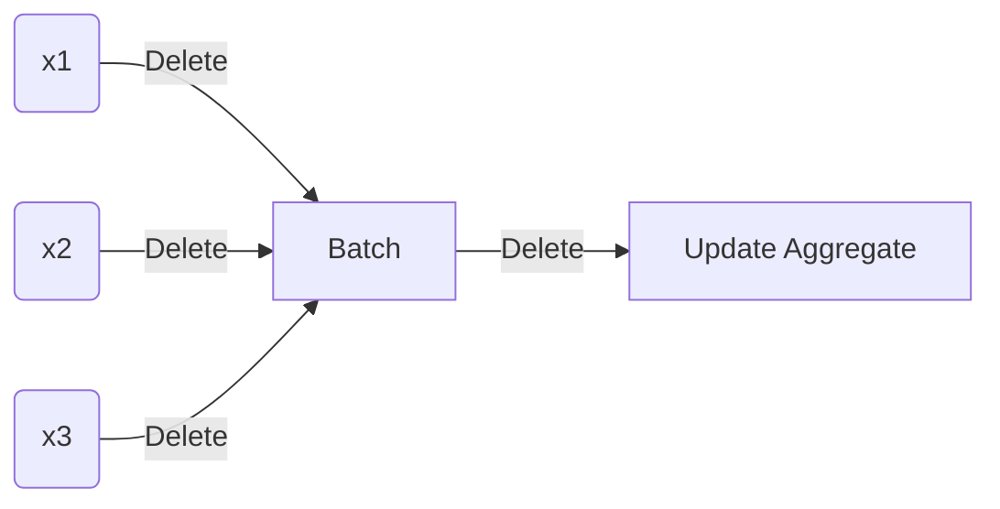

# Getting Started with Privacy First Data Science: recursive mean and variance

> Draft. Feedback highly welcome at [@chrisgandrud](https://twitter.com/ChrisGandrud)

## How Data Scientists Usually do it

How much time have you spent thinking about calculating the mean and variance of some sample? Probably not much. When you run an A/B test you probably run the standard `t.test` or whatever function. This does some calculations with your data that you learned in the first day of Stats 101 like the arithmetic mean ($\bar{x}$):

$$
\bar{x} = \frac{1}{n}\sum_{i=1}^{n} x_i
$$
and variance ($\mathrm{Var}(X)$) via the sum of squared deviations ($S$):
$$
S = \sum_{i=1}^{n}(x_i - \bar{x})^2
$$

$$
\mathrm{Var}(X) = \frac{S}{n-1}.
$$

Ok, so what?

Let's think about the problem we are trying to solve and unintended privacy implications of using the classic solution. We often want to understand the population (or some group in the population) level impact. We don't want dive deep on individual people. But the simple equation for the mean and sum of squares has these $\sum_{i=1}^{n}$. They require us to have all of the $x_i$ observations at the same time to calculate these statistics. So, we need to keep all of this data for each person $i$ in the study up until and including when we calculate these statistics. 

## Minimum data collection and retention: a privacy principle

A good rule of thumb for privacy first data science is that:

> we should collect and keep the absolute mimimum amount of individual's data possible. 

If we don't have a good reason to collect the data,[^1] don't collect it. If there is a way to calculate a statistic without retaining individuals' data, use that method and don't retain the data beyond what is necessary.  

Ok, let's assume we had a good reason to find the mean and variance of some sample, **did we keep the data the absolute minimum amount of time when we used the standard formulas**?

**Probably not.**

## Recursively calculate mean and variance

Is there another way to calculate means and variances without needing to store entire data sets? Yes, with recursive mean and variance algorithms.[^2] When we calculate a statistic recursively, we break down the calculation problem into smaller parts of the same type and calculate a statistic for each part.[^3]

### Setup

Before jumping into the formulas, let's discuss the data gathering process we are working with. We are running an experiment. During the experiments we receive new observations $x_i$ for the outcome $x$ for $i$th people. We could recursively calculate our statistics for each new $x_i$, however, given latency in our data gathering process it is more realistic that we would gather observations into small **batches** $K$. We then want to update our estimates using the new batch and then immediately delete individuals' data in the batch and the batch data. Something like:



Note that while the math is straightforward, the implementation of recursive mean and variance is more complex. Rather than just collecting all of the data into one large database, we need add a data transformation step doesn't return the raw observation. Instead, it that queries the previous estimates of the static and returns an update of the global aggregate statistics. Ideally, for privacy preservation, we would even delete the values prior to the update.

### Recursive (batch) mean	

We update our calculation of the mean for each batch using:
$$
\bar{x}_{t^\prime} = \bar{x}_{t} + \frac{1}{t^\prime}[\Delta_k - (t^\prime - t) \bar{x}_{t}]
$$
where:

-  $t$ number of observations up to, but not including the new batch
- $t^\prime$ total number of observations after including the batch 
- $\bar{x}_t$ mean before including the batch 
- $\Delta_k$ batch sum of $x_k$. 

### Recursive (batch) variance	

There is a whole [Wikipedia article](https://en.wikipedia.org/wiki/Algorithms_for_calculating_variance) on algorithms for recursively calculating variance, because as the article begins:

> "Algorithms for calculating variance play a major role in computational statistics. A key difficulty in the design of good algorithms for this problem is that formulas for the variance may involve sums of squares, which can lead to numerical instability as well as to arithmetic overflow when dealing with large values."

One approach--drawing on [Chou (2021, p. 4)](https://arxiv.org/pdf/2102.03316.pdf) and [Chan et al. (1983, eq 1.5)](http://www.cs.yale.edu/publications/techreports/tr222.pdf)--starts with the following formula for the sum of squared differences from the mean:
$$
s_{t^′} = s_{t} + s_{k} + \frac{t}{t^\prime}(t^\prime - t)(\bar{\Delta}_k - \bar{x}_{t})^2
$$
where:

- $s_t$ sum of squared deviations for all of the observations prior to the current batch $k$ 
- $s_k$ sum of squares for batch $k$
- $\bar{\Delta}_k$ batch $k$ mean.

The result is then plugged into the standard variance formula:
$$
\mathrm{Var}(X)_{t^\prime} = \frac{s_{t^\prime}}{t^\prime-1}.
$$


### Example

Let's bring this all together with a simulation example. Let's keep it simple and draw the observations from: 
$$
X \sim \mathcal{N}(0, 1).
$$
The full code for the simulation is available [here](https://gist.github.com/christophergandrud/9575abca943dc70f1bbbf4b8a95e73f9). 

First, *initialise* the batch sequence by finding the mean, variance, and sum of squares of the first batch using the standard formulas. Only from the second batch, do we use the recursive formulas. 

Then, for each new batch, we update using:

```julia
"""
    batch_mean_variance(batchₖ::Vector{Real}, t::Int64, x̄ₜ::Real, sₜ::Real)
Update estimate of mean, variance, and sum of squared deviations, batch of observations
"""
function batch_mean_variance(batchₖ, t::Int64, x̄ₜ::Real, sₜ::Real)
    # mean ----------
    Δₖ = sum(batchₖ)
    t′ = t + length(batchₖ)
    x̄ₜ′ = x̄ₜ + (1/t′) * (Δₖ - ((t′ - t) * x̄ₜ)) 

    # variance ------
    Δ̄ₖ = mean(batchₖ) 
    sₖ = sum_of_squares(batchₖ)
    sₜ′ = (sₜ + sₖ) + (t / t′) * (t′ - t) * (Δ̄ₖ - x̄ₜ)^2
    varianceₜ′ = sₜ′ / (t′ - 1)

    return (mean_updated = x̄ₜ′, variance_updated = varianceₜ′, 
     sum_squares_updated = sₜ′, observations = t′)
end
```

#### The problem of roundoff errors	

Are the numbers computed recursively exactly the same as those computed as if we had the entire sample? The answer is no, because of how we represent numbers in the computer and address roundoff errors. So how big is the problem? 

Well let's compare the mean and variance estimates from the recursive algorithms to the estimates we would get at each batch step if we retained the entire sample and ran the standard mean and variance formulas:


Two observations, (a) the absolute errors are very small and probably not substantively meaningful (though I would stress test this for other applications), while error in the mean decreases and then converges with the number of batches, the variance error increases. Though it is still substantively small.

### Going further

This was a deep dive on the most basic of data science statistics--mean and variance--but recursive algorithms can also be used when we are interested in things like heterogenous treatment effects/regression adjustment to reduce variance, and with dependent data. See [Chou (2021)](https://arxiv.org/pdf/2102.03316.pdf) for details.


[^1]: Let's leave aside for now what 'good reason' means, but the GDPR could be a good guide.
[^2]: This section draws heavily from Winston Chou's working paper [\"Randomzed Controlled Trials with Minimal Data Retention\"](https://arxiv.org/pdf/2102.03316.pdf) with a correction to the variance formula drawn from [Chan et al. (1983).](http://www.cs.yale.edu/publications/techreports/tr222.pdf)

[^3]: **Historical side note:** most data scientists these days were likely taught how to calculate means and variances when computers were already powerful enough to easily do these calculations without the *need* for recursion. Historically, however, computers (or even groups of people, usually women [doing computations](https://en.wikipedia.org/wiki/Women_in_computing#1980s) for less pay than men) this was a useful way to approach calculations of large sets of numbers. It meant that you could break the problem down and distribute it across lots of "computers". So much of the work on recursive mean, and the harder problem of recursive variance, comes from an earlier era of computing to solve different problems unrelated to privacy. Additional note: the reliance on women to do computation led to one of the foundational units of computation from the 1940s-1970s being the "[girl-hour](https://en.wiktionary.org/wiki/girl-hour)".

